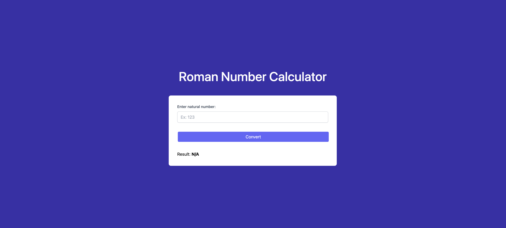

# Roman Number Calculator with Next.js

This project was bootstrapped with [Create Next App](https://github.com/vercel/next.js/tree/canary/packages/create-next-app#readme).

More info about the Roman Number Calculator [here](https://en.wikipedia.org/wiki/Roman_numerals).

### Desktop:

### Mobile

## Development

To develop locally you need the following steps:

### `npm run install`

Install npm dependencies; you should run that regularly, preferably after every git pull, so that new and updated dependencies are installed locally.

### `npm run dev`

To start the dev server. After you start you development server, <http://localhost:3000/> by default.

The page will reload if you make edits. 
You will also see any lint errors in the console.

### `npm run test`

To run the tests.

You can use `npm run test:watch` to run Jest in watch mode that reruns tests when you do code changes.

## Deployment

### `npm run build`

Builds the app for production to the `.next` folder. 
It generates an optimized version of your application for production.

All JavaScript code inside .next has been compiled and browser bundles have been minified to help achieve the best performance and support all modern browsers.

See the section about [deployment](https://nextjs.org/docs/deployment#nextjs-build-api) for more information.

## Technical Guidelines

### 1. General Rules

1.1 YAGNI (You Arent Gonna Need It)

1.2 Separation of concerns

### 2. Naming Conventions

2.1 Field names should use camelCase. Same as we do in JavaScript.

2.2 Type names should use PascalCase. This matches how classes are defined in JavaScript.

2.3 Avoid Abbreviations. Prefer being explicit about names.
